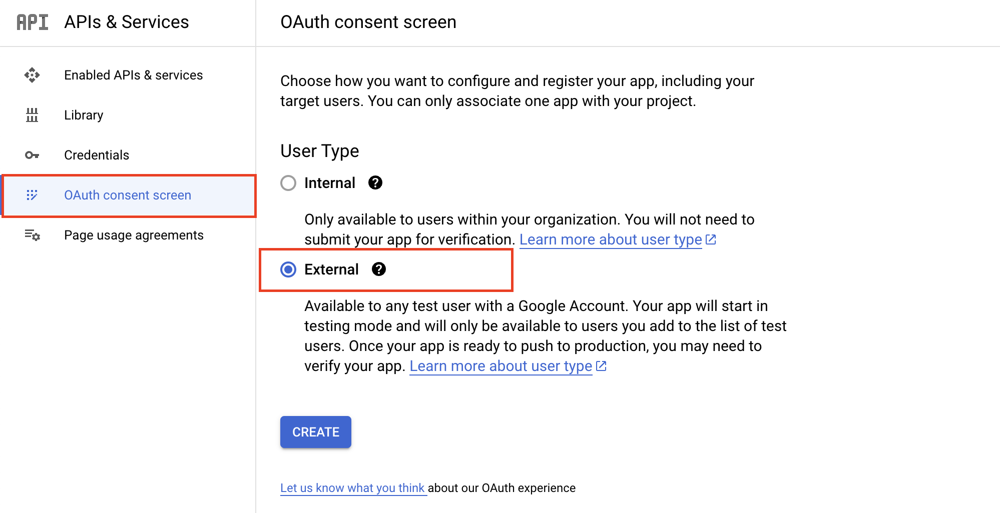
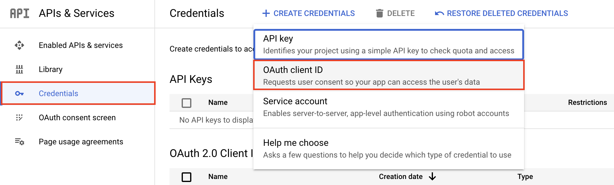

# Google OAuth Login

1. Go to the [Google API Console](https://console.cloud.google.com/apis/credentials).
2. Create a new project or select an existing one.
3. Configure the [OAuth consent screen](https://developers.google.com/workspace/guides/configure-oauth-consent#configure_oauth_consent).

4. Create [OAuth 2.0 credentials](https://developers.google.com/workspace/guides/create-credentials#oauth-client-id).
- credentials > create credentials > OAuth client ID

- Choose **web application** as the type of project/application's credential
- Add localhost to Authorized JavaScript origins

5. Copy the client id into your `frontend_app/.env.local`
