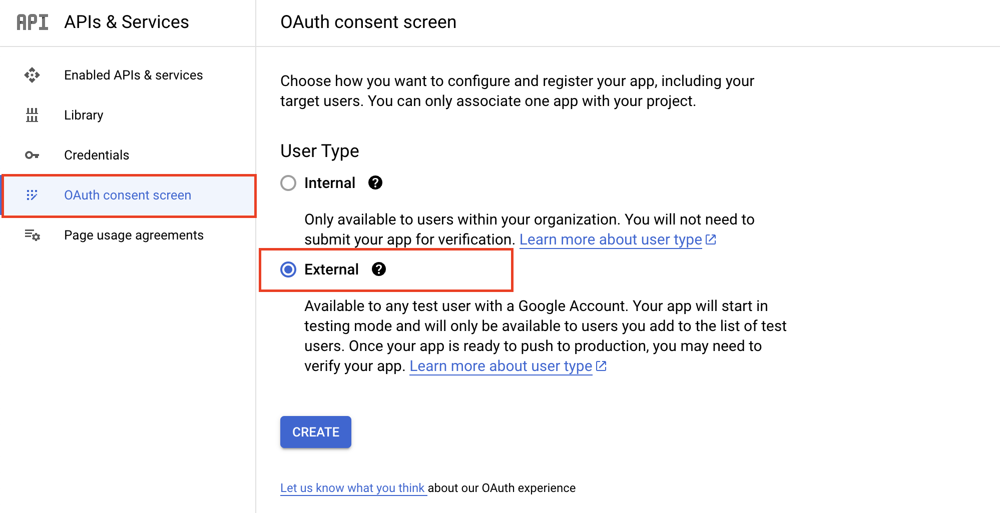
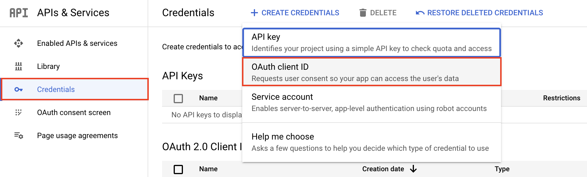
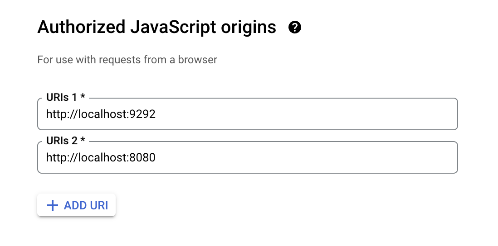

# Google API Setup

## OAuth Login

1. Go to the [Google API Console](https://console.cloud.google.com/apis/credentials).
2. Create a new project or select an existing one.
3. Configure the [OAuth consent screen](https://developers.google.com/workspace/guides/configure-oauth-consent#configure_oauth_consent).

4. Create [OAuth 2.0 credentials](https://developers.google.com/workspace/guides/create-credentials#oauth-client-id).
- credentials > create credentials > OAuth client ID

- Choose **web application** as the type of project/application's credential
- Add these URLs to **Authorized JavaScript origins**:
  - `http://localhost:8080` (frontend dev server)
  - `http://localhost:9292` (backend server)

5. Copy the **Client ID** into your `frontend_app/.env.local` as `VUE_APP_GOOGLE_CLIENT_ID`

## Maps API

The attendance and locations maps require a Google Maps JavaScript API key.

1. Go to the [Google Cloud Console](https://console.cloud.google.com/apis/library).
2. Select your project (or create one).
3. Search for **Maps JavaScript API** and enable it.
4. Search for **Places API (New)** and enable it. The Locations tab uses it to show the name and address of a place (a building or business) that a user clicks on the map. Without it, clicking a place still works, but the user must type the name.
5. Go to [Credentials](https://console.cloud.google.com/apis/credentials) and create an **API key**.
6. (Recommended) Restrict the key:
   - Under **Application restrictions**, select **HTTP referrers**
   - Add your allowed domains:
     - `http://localhost:9292/*` (local development; a bare `localhost:*` does not match page paths)
     - `your-app.herokuapp.com/*` (production)
   - If you set **API restrictions**, allow both **Maps JavaScript API** and **Places API (New)**.
7. (Recommended) Limit Places API (New) cost: each place click makes one Place Details request. In **APIs & Services → Places API (New) → Quotas**, set a per-day request limit, and add a budget alert under **Billing → Budgets & alerts**.
8. Copy the API key into your `frontend_app/.env.local` as `VUE_APP_GOOGLE_MAP_KEY`
9. For production, set on Heroku:

   ```bash
   heroku config:set VUE_APP_GOOGLE_MAP_KEY=<your-maps-api-key>
   ```

**Note**: Ensure billing is enabled on your Google Cloud project, as the Maps API requires it after the free tier quota.
